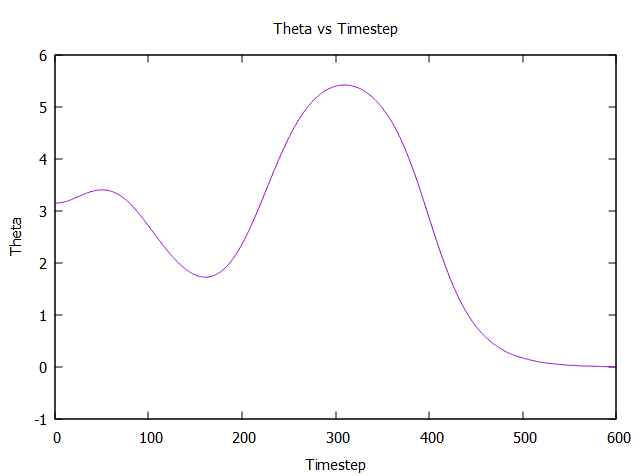
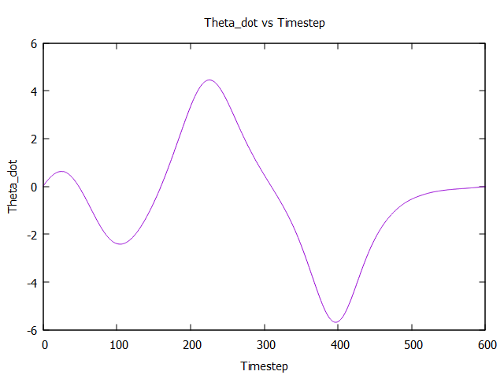
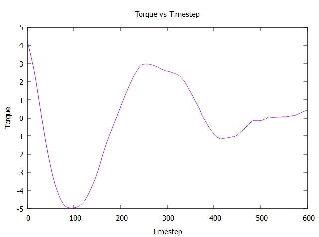

# Pendulum Trajectory Optimization using Squential Quadratic Programming

After watching Russ Tedrake's [trajectory optimization](https://www.youtube.com/watch?v=g-VehRFsDcI&list=PL58F1D0056F04CF8C&index=9&ab_channel=MITOpenCourseWare) lecture and Stephen Boyd's [sequential convex programming](https://www.youtube.com/watch?v=upMWYV7S1Y0&t=3800s&ab_channel=Stanford), I wanted to apply what I've learned into controlling a simple pendulum such that it can swing up to the inverted position. In a nutshell, the pendulum's trajectory is optimized using the following steps: 

* Discretize the pendulum dynamics using direct collocation.
* Linearize the discretized dynamics using Taylor series expansion.
* Formulate the problem as a quadratic program.
* Solve the optimization problem iteratively using sequential convex programming (SCP).

Interestingly, I found that after SCP converged, the slack variables corresponding to the linearized dynamics constraints did NOT approach zeros despite I have set their costs to be very large in the objective function. To further subdue the dynamics violations, I would increase the costs of the slack variables that are greater than a certain threshold, and then perform SCP again. The process is repeated until ALL slack varaibles are below the threshold. Doing this greatly improve the final solution, which is shown below:

  

  

  

With the optimized trajectories above, the pendulum would have the following motion:

  

